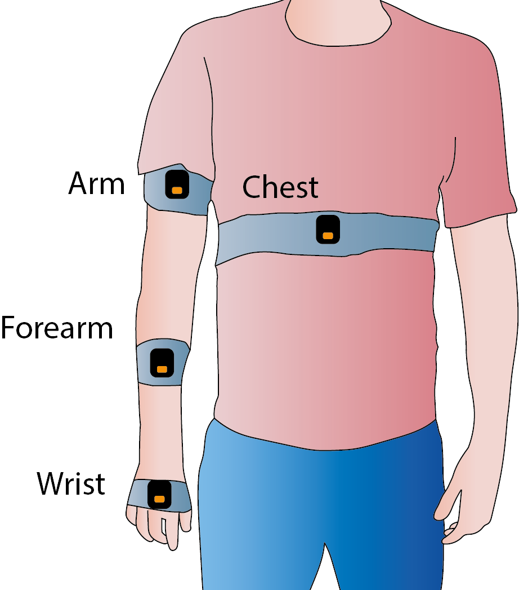
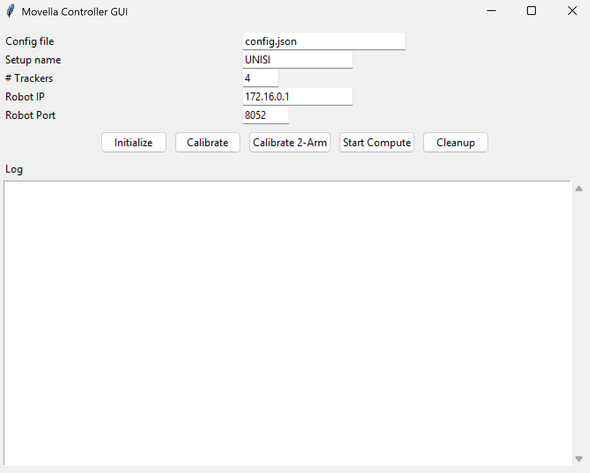
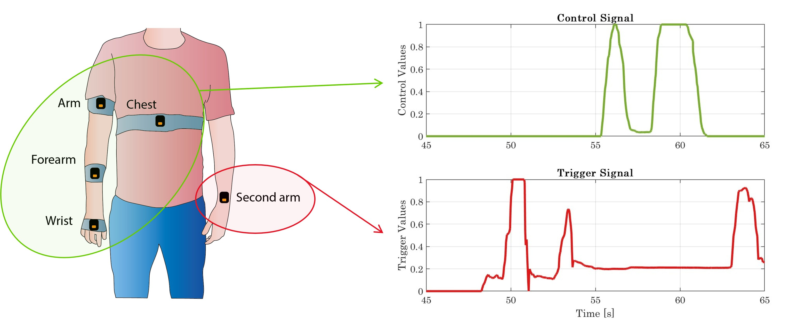

# Arm Motion Tracking System with Movella Xsens IMU Sensors

This repository provides a pipeline for tracking arm motion with Movella Xsens IMU sensors.
It includes a Python wrapper for initializing the sensors, reading their data directly in Python, streaming values over UDP, and processing motion signals with PCA to produce a one-dimensional control signal.

This work is part of a study that aims to map residual motion of people with post-stroke conditions or spinal cord injury to control an external robotic device. The paper can be read here: [Pozzi et al., 2025](https://journals.sagepub.com/doi/10.1177/02783649251403013)

## Overview

The code communicates with Movella Xsens IMU sensors over Bluetooth. It supports real-time acquisition, calibration, kernel computation, and UDP transmission of motion data.

### Main Features

- Connects to Movella Xsens sensors over Bluetooth.
- Streams IMU data in real time.
- Calibrates motion signals with PCA.
- Computes normalized kernel values for downstream control.
- Sends motion data through UDP.

### Main Script

The main entry point is [movella_streamer_class.py](movella_streamer_class.py), which exposes the `MovellaStreamer` class for initialization, streaming, calibration, and kernel generation.

## MovellaStreamer Class

The `MovellaStreamer` class wraps the Movella Xsens DOT SDK and provides a simple workflow for data collection and processing.

### Constructor

```python
MovellaStreamer(config_path, setup_name, udp_ip=None, udp_port=None, frequency=60, n_trackers=5)
```

Parameters:

- `config_path`: Path to [config.json](config.json), which contains the tracker MAC addresses.
- `setup_name`: Key inside the configuration file, for example `UNISI`.
- `udp_ip`, `udp_port`: Optional UDP destination for streaming.
- `frequency`: Sampling frequency in Hz.
- `n_trackers`: Number of trackers to use. Supported values are `1`, `2`, `4`, and `5`.

The `config.json` file stores one or more tracker layouts. The included `UNISI` configuration is an example; update it to match the MAC addresses of the trackers you are using.

### Main Methods

`initialize()`

- Scans for Movella DOT devices, connects to them, and starts measurement mode.

`get_latest_data()`

- Returns the most recent sample as a dictionary containing the timestamp, the number of working trackers, and quaternion data.

`stream_loop()`

- Continuously prints the latest tracker data in the terminal.

`stream_udp_loop()`

- Continuously streams the latest data over UDP.

`cleanup()`

- Stops measurement, disables logging, and resets device orientation.

### Control Signal Methods

`calibrate(calibration_name="movellaValue1Phase", saved_data=True)`

- Records repeated motions, computes PCA, and saves calibration parameters for one-phase control.

`calibrate_2arm(imu="2arm", saved_data=True)`

- Records a start and end quaternion for two-arm trigger calibration.

`compute_kernel(send_ip="172.16.0.1", send_port=8052, plot_data=False)`

- Computes the normalized kernel value and sends it over UDP.

`compute_easy_kernel(send_ip="172.16.0.1", send_port=8052, plot_data=False)`

- Computes a simplified kernel for hand-only or hand-plus-second-arm setups.

## Requirements

- Python 3.8, 3.9, or 3.10.
- Movella Xsens IMU sensors.
- Movella DOT PC SDK, available from the [official guide](https://base.xsens.com/s/article/Movella-DOT-PC-SDK-Guide?language=en_US).
- Python dependencies listed in [requirements.txt](requirements.txt).

## Installation

Install the Python dependencies:

```bash
pip install -r requirements.txt
```

Then install the Movella SDK wheel that matches your Python version and operating system.

The repository includes these wheels:

- `movelladot_pc_sdk-2023.6.0-cp310-none-win_amd64.whl` for Windows and Python 3.10
- `movelladot_pc_sdk-2023.6.0-cp38-none-linux_x86_64.whl` for Linux and Python 3.8

Examples:

```bash
# Windows + Python 3.10
pip install .\movelladot_pc_sdk-2023.6.0-cp310-none-win_amd64.whl
```

```bash
# Linux + Python 3.8
pip install ./movelladot_pc_sdk-2023.6.0-cp38-none-linux_x86_64.whl
```

## Usage

To extract a control signal from a single arm, wear the Movella sensors as shown below:

<p align="center">
   
</p>

Start the GUI with:

```bash
python movella_gui.py
```

The GUI will open as shown here:

<p align="center">
   
</p>

From the GUI, you can configure:

- The configuration file name.
- The setup name defined inside the configuration file.
- The number of trackers to use.
- The IP address and port for UDP streaming of control values.

The following buttons are used to compute and stream the control values:

- **Initialize**: start the connection using the configuration already selected in the GUI.
- **Calibrate**: perform PCA calibration. The user should repeat the target motion 8 to 10 times.
- **Calibrate 2-Arm**: perform a calibration with a single Movella sensor, selected in advance, by setting the start and end posture positions.
- **Start Compute**: compute the control value from one or two calibrations, and stream the values to the configured IP address and port over UDP. Up to two control values can be streamed at the same time.
- **Cleanup**: stop the connection with the Movellas.

In the following an example of the procedure to compute calibration and online control:

<p align="center">
   <video src="media/control_extraction.mp4" controls width="600">
      Your browser does not support the video tag. Download the video here: <a href="media/control_extraction.mp4">control_extraction.mp4</a>
   </video>
</p>

An example using two control signals is shown here: 
<p align="center">
   
</p>

# Cite Us!

If you found this work useful for developing your own research, please consider citing us using the following BibTeX entry:


```bibtex
@article{pozzi2025wearable,
   author = {Maria Pozzi and Nicole D’Aurizio and Bernardo Brogi and Giovanni Cortigiani and Leonardo Franco and Manish Shukla and Alessandro Giannotta and Simone Rossi and Sarah Skavron and Susanne Frennert and Gionata Salvietti and Monica Malvezzi and Domenico Prattichizzo},
   title = {Wearable and grounded supernumerary robotic limbs for sensorimotor augmentation in post-stroke patients},
   journal = {The International Journal of Robotics Research},
   volume = {0},
   number = {0},
   year = {2025},
   doi = {10.1177/02783649251403013},
   url = {https://doi.org/10.1177/02783649251403013}
}
```


